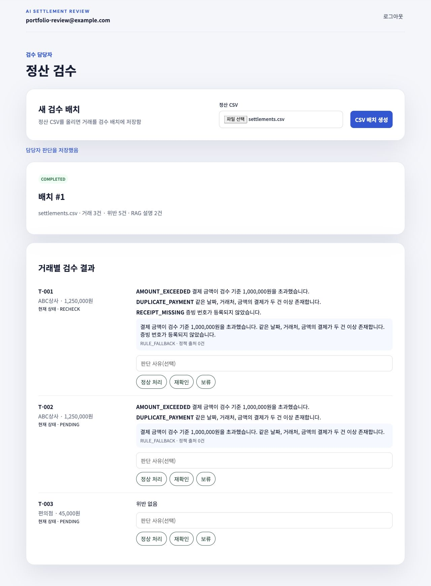

# AI Settlement Review Agent

정산 데이터의 이상 항목을 규칙 기반으로 검수하고, AI가 확인 이유와 후속 작업을 설명하는 Spring Boot 기반 업무 보조 Agent입니다.

## 프로젝트 목표

정확한 판별이 필요한 금액·중복·증빙 검사는 Java 코드로 처리합니다. AI는 검수 결과를 사용자가 이해하기 쉽게 설명하고 확인 사항을 제안하는 역할을 담당합니다. AI의 제안은 사용자가 승인하기 전까지 실제 처리 상태를 변경하지 않습니다.

## 현재 구현

- 1,000,000원 초과 거래 검수
- 증빙 번호 누락 검수
- 날짜·거래처·금액 기준 중복 결제 검수
- 여러 검수 규칙을 조합하는 서비스
- CSV 업로드·입력 검증과 검수 배치 영구 저장
- 거래별 규칙 위반과 과거 배치 상세 조회
- 정책 검색 기반 구조화된 AI 설명과 RAG 장애 fallback
- 사용자 정상 처리·재확인·보류와 MySQL 판단 이력
- 세션 기반 회원가입·로그인과 사용자·관리자 권한
- 별도 React + TypeScript 프론트엔드
- 관리자 정책 문서 등록과 Chroma 인덱싱
- 검수 규칙 단위 테스트

## 기술 스택

- Java 21
- Spring Boot 3.5
- Spring Web
- Bean Validation
- JUnit 5 / AssertJ
- Gradle
- MySQL 8 이상
- React / TypeScript / Vite
- Python / FastAPI / Chroma

## 실행

MySQL 서버에서 최초 한 번 프로젝트 DB와 로컬 개발 계정을 생성합니다.

```bash
mysql -u root -p < docs/mysql-setup.sql
```

환경별 접속 정보는 `.env`에 둡니다. 기본 로컬 개발값은 `.env.example`과 같습니다.

```bash
cp .env.example .env
# .env에서 OPENAI_API_KEY와 DB 접속 정보를 환경에 맞게 수정
./gradlew clean test
./gradlew bootRun
```

React 화면은 별도 터미널에서 실행합니다.

```bash
cd frontend
npm install
npm run dev
```

정책 문서 등록을 사용할 때 Python 서비스를 실행합니다.

```bash
cd rag-service
python3 -m venv .venv
.venv/bin/pip install -r requirements.txt
set -a
source ../.env
set +a
.venv/bin/uvicorn app.main:app --reload --port 8001
```

브라우저에서 `http://localhost:5173`을 엽니다. 로컬 관리자 계정은 `.env`의 `ADMIN_EMAIL`, `ADMIN_PASSWORD`로 생성합니다.

Windows PowerShell에서는 다음 명령을 사용합니다.

```powershell
.\gradlew.bat bootRun
```

CSV 배치 업로드 API는 로그인 세션과 CSRF 토큰이 필요한 `POST /api/review-batches`입니다. 브라우저 화면을 이용하면 인증부터 업로드와 결과 확인까지 한 흐름으로 테스트할 수 있습니다.

주요 API는 다음과 같습니다.

| 기능 | Method | 경로 |
|---|---|---|
| 회원가입 | `POST` | `/api/auth/register` |
| 로그인 | `POST` | `/api/auth/login` |
| 정책 목록·등록 | `GET`, `POST` | `/api/admin/policies` |
| CSV 검수 배치 생성 | `POST` | `/api/review-batches` |
| 배치 상세 조회 | `GET` | `/api/review-batches/{batchId}` |
| 거래 담당자 판단 | `POST` | `/api/review-batches/{batchId}/transactions/{transactionId}/decisions` |

## 실행 화면



## 테스트

```bash
./gradlew test

cd frontend
npm run test
npm run build

cd ../rag-service
.venv/bin/python -m unittest discover -s tests -v
```

## 설계 문서

- [기획 및 구현 범위](docs/planning.md)
- [아키텍처 및 설계 의사결정](docs/architecture.md)
- [ERD 및 데이터 정의](docs/erd.md)
- [AI 협업 기록](docs/ai-collaboration.md)

## 검증 범위

- 검수 규칙·CSV 파서 단위 테스트
- 인증, 배치 저장·상세 조회, 담당자 판단, RAG fallback API 통합 테스트
- React 로그인·CSV 업로드·상세 결과 컴포넌트 테스트와 프로덕션 빌드
- Python 정책 색인·검색·설명 응답 단위 테스트
- 샘플 CSV 브라우저 업로드와 결과 화면 확인
- H2 MySQL 호환 모드 통합 테스트


