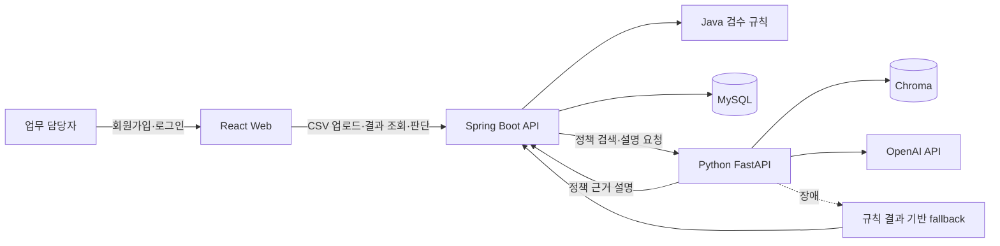

# 아키텍처 및 설계 의사결정

## 전체 흐름

## 역할 분리

| 구성 요소 | 책임 | 선택 이유 |
|---|---|---|
| React + TypeScript | 로그인, CSV 업로드, 상세 결과와 담당자 판단 표시 | 백엔드 API와 사용자 업무 흐름을 독립적으로 검증하기 위함 |
| Spring Boot | 인증, 입력 검증, 검수 흐름과 접근 권한 제어 | 교육 과정에서 익힌 Java 백엔드를 실제 B2B 업무 흐름에 적용하기 위함 |
| `SettlementReviewRule` 구현체 | 금액·중복·증빙 판정 | 같은 입력의 판정 결과를 항상 동일하게 유지하기 위함 |
| `ReviewBatchService` | 배치·거래·위반·설명 저장과 상세 조회 | 한 번의 업로드를 추적 가능한 업무 단위로 관리하기 위함 |
| `PolicyRagClient` | Python RAG 서비스 호출 경계 | Java 검수 로직이 벡터 DB와 AI 공급자 구현에 의존하지 않게 하기 위함 |
| FastAPI + Chroma | 정책 문서 색인, 관련 문단 검색, 설명 생성 | 문서 검색 실험을 Python 생태계로 분리하고 Java 서비스의 책임을 작게 유지하기 위함 |
| MySQL | 사용자, 정책, 배치, 거래, 위반, 설명, 판단 이력 저장 | 서버를 다시 실행해도 과거 검수 근거와 담당자 판단을 조회하기 위함 |

## 핵심 설계 판단

### 규칙 판정과 AI 설명 분리

금액 초과, 증빙 누락, 중복 결제는 정확성과 재현성이 필요한 영역이므로 Java 규칙으로 확정한다. AI는 확정된 위반 결과와 검색된 정책 근거를 사람이 이해하기 쉬운 설명으로 바꾸는 역할만 맡는다. AI 응답이 달라져도 거래의 위반 여부는 바뀌지 않는다.

### RAG 장애 격리

Python 서비스, Chroma 또는 OpenAI 호출이 실패하면 해당 예외를 배치 전체 실패로 전파하지 않는다. 이미 확정된 규칙 위반 사유로 fallback 설명을 만들고 `generatedBy`에 생성 경로를 기록한다. 외부 AI가 불안정해도 핵심 검수와 이력 저장은 계속된다.

### JDBC 선택

현재 저장 로직은 정해진 SQL로 배치와 하위 데이터를 한 번에 기록하고, 소유자 또는 관리자 조건을 포함해 상세 데이터를 조회하는 형태다. 복잡한 객체 그래프나 변경 감지보다 실행되는 SQL과 트랜잭션 범위를 명확히 보는 편이 중요해 `JdbcTemplate`을 선택했다. 도메인 관계와 조회 조합이 더 복잡해지면 JPA 전환을 검토할 수 있지만, 현재 범위에서는 JDBC가 구현과 설명 모두 단순하다.

### 별도 React 프로젝트

초기에는 핵심 검수 API를 빠르게 확인하려고 정적 화면을 사용했다. 이후 회원가입·로그인, 정책 등록, 배치 상세, 담당자 판단까지 사용자 흐름이 늘어나면서 화면 상태와 API 경계를 분명하게 검증할 필요가 생겨 React 프로젝트로 분리했다. Vite 개발 서버는 Spring Boot API를 프록시하고, 프론트 단위 테스트와 프로덕션 빌드를 별도로 수행한다.

### 데이터 저장 범위

업로드한 CSV 파일 자체와 원본 바이트는 보관하지 않는다. 검수 재현과 이력 조회에 필요한 정규화된 거래 필드, 위반 결과, AI 설명, 사용자 판단만 저장한다. 실제 운영에서는 개인정보 분류, 암호화, 보존 기간과 삭제 정책을 먼저 확정한 뒤 원문 보관 여부를 결정해야 한다.

## 실패 및 권한 처리 원칙

- CSV 형식 오류는 이해 가능한 `400` 응답으로 반환함
- 로그인 사용자는 자신의 배치만 조회하고 관리자는 전체 배치를 조회할 수 있음
- AI 연결 실패 시 규칙 결과와 배치 저장을 유지함
- AI가 거래 상태를 직접 변경하지 못하게 함
- 담당자 판단은 사용자 동작이 있을 때만 별도 이력으로 추가함
- API 키와 DB 비밀번호는 소스가 아닌 환경변수로 주입함

## 테스트 전략

- 규칙과 CSV 파서는 단위 테스트로 경계값과 오류 조건을 확인함
- Spring API는 MockMvc로 인증, 소유권, 저장 결과, RAG fallback을 확인함
- 운영 DB는 MySQL을 사용하고 자동 테스트는 H2 MySQL 호환 모드로 실행함
- React는 Vitest로 로그인과 업로드·상세 흐름을 확인하고 Vite 프로덕션 빌드를 수행함
- Python RAG 서비스는 단위 테스트로 색인과 검색·응답 변환을 확인함
