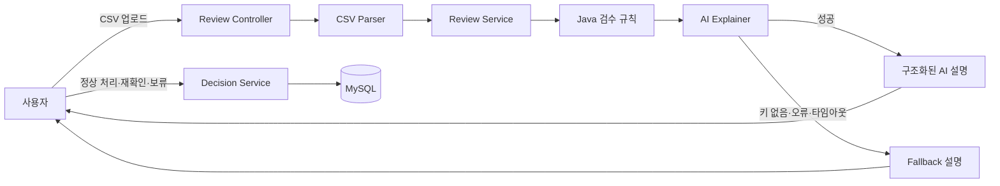

# 아키텍처 및 설계 의사결정

## 전체 흐름

## 역할 분리

| 구성 요소 | 책임 | 직접 결정한 이유 |
|---|---|---|
| `CsvSettlementParser` | CSV 형식과 입력값 검증 | 잘못된 입력을 검수 규칙과 AI에 전달하지 않기 위함 |
| `SettlementReviewRule` 구현체 | 금액·중복·증빙 판정 | 동일 입력의 판정 결과를 항상 동일하게 유지하기 위함 |
| `SettlementReviewService` | 여러 규칙의 결과 조합 | 규칙 추가 시 Controller와 AI 코드를 수정하지 않기 위함 |
| `AiReviewExplainer` | AI 연결 경계 | AI 공급자와 규칙 판정 로직의 결합을 피하기 위함 |
| `FallbackReviewExplainer` | AI 미사용·장애 시 기본 설명 | 외부 API 장애가 핵심 검수 기능을 중단시키지 않기 위함 |
| `ReviewDecisionService` | 사용자 결정 이력 저장 | AI 제안과 사용자의 최종 판단을 구분하기 위함 |

## 별도 프론트엔드를 만들지 않은 이유

현재 화면은 CSV 업로드, 집계 표시, 거래별 결과 확인, 사용자 결정 버튼으로 구성된 단일 업무 화면이다. React 프로젝트를 별도로 만들면 프론트 빌드, CORS, API 주소 관리, 배포 단위가 추가되지만 현재 사용자 흐름에는 상태 관리나 복잡한 라우팅이 필요하지 않다.

따라서 Spring Boot의 정적 HTML·CSS·JavaScript를 사용해 한 번의 `bootRun`으로 전체 기능을 확인할 수 있게 했다. 화면이 여러 메뉴로 확장되거나 사용자 인증, 복잡한 검색·필터, 공통 컴포넌트가 필요해지는 시점에 별도 프론트엔드로 분리할 계획이다.

## 데이터 저장 범위

CSV 거래는 업로드 요청 동안만 검수에 사용하고 원문 전체를 DB에 저장하지 않는다. 현재 MySQL에는 사용자가 선택한 결정 이력만 저장한다. 개인정보와 원본 정산 데이터를 장기간 보관하려면 암호화, 보존 기간, 삭제 정책이 함께 필요하므로 MVP 범위에서 제외했다.

## 실패 처리 원칙

- CSV 입력 오류는 이해 가능한 `400` 응답으로 반환함
- AI 키가 없거나 AI 호출이 실패해도 Java 검수 결과를 반환함
- AI가 정상 여부나 사용자 처리 상태를 직접 변경하지 못하게 함
- DB에는 사용자가 명시적으로 선택한 결정만 저장함

## 테스트 전략

- 규칙과 CSV 파서는 단위 테스트로 경계값과 오류 조건을 확인함
- API는 MockMvc 통합 테스트로 업로드와 결정 저장·조회를 확인함
- 운영 DB는 MySQL을 사용하고 테스트 DB는 H2 MySQL 호환 모드를 사용함
- 최종 사용자 흐름은 샘플 CSV를 실제 브라우저에서 업로드해 확인함
