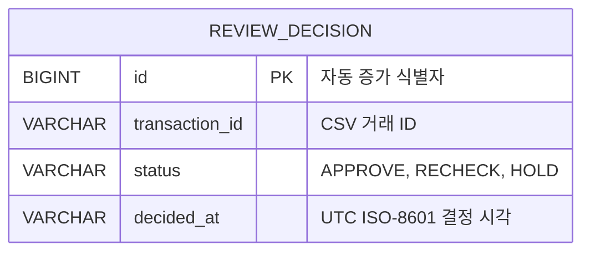

# ERD 및 데이터 정의

현재 MVP는 업로드한 거래 원문 전체가 아니라 사용자의 최종 결정 이력만 영구 저장한다.

## `review_decision`

| 컬럼 | 타입 | Null | 설명 |
|---|---|---|---|
| `id` | `BIGINT` | 불가 | 결정 이력의 자동 증가 PK |
| `transaction_id` | `VARCHAR(100)` | 불가 | 업로드 CSV에서 전달된 거래 식별자 |
| `status` | `VARCHAR(20)` | 불가 | 사용자가 선택한 `APPROVE`, `RECHECK`, `HOLD` 중 하나 |
| `decided_at` | `VARCHAR(40)` | 불가 | Java `Instant`의 UTC ISO-8601 문자열 |

## 인덱스

- `idx_review_decision_transaction_id`: 거래 ID별 이력 조회에 사용함

## 관계와 제약에 대한 판단

`transaction_id`는 CSV 거래를 가리키는 논리적 참조지만 현재 DB에 거래 원문 테이블이 없으므로 외래 키를 적용하지 않았다. 향후 거래 원문을 저장하게 되면 `settlement_transaction` 테이블을 추가하고 외래 키, 업로드 배치 ID, 사용자 ID를 함께 연결할 계획이다.
