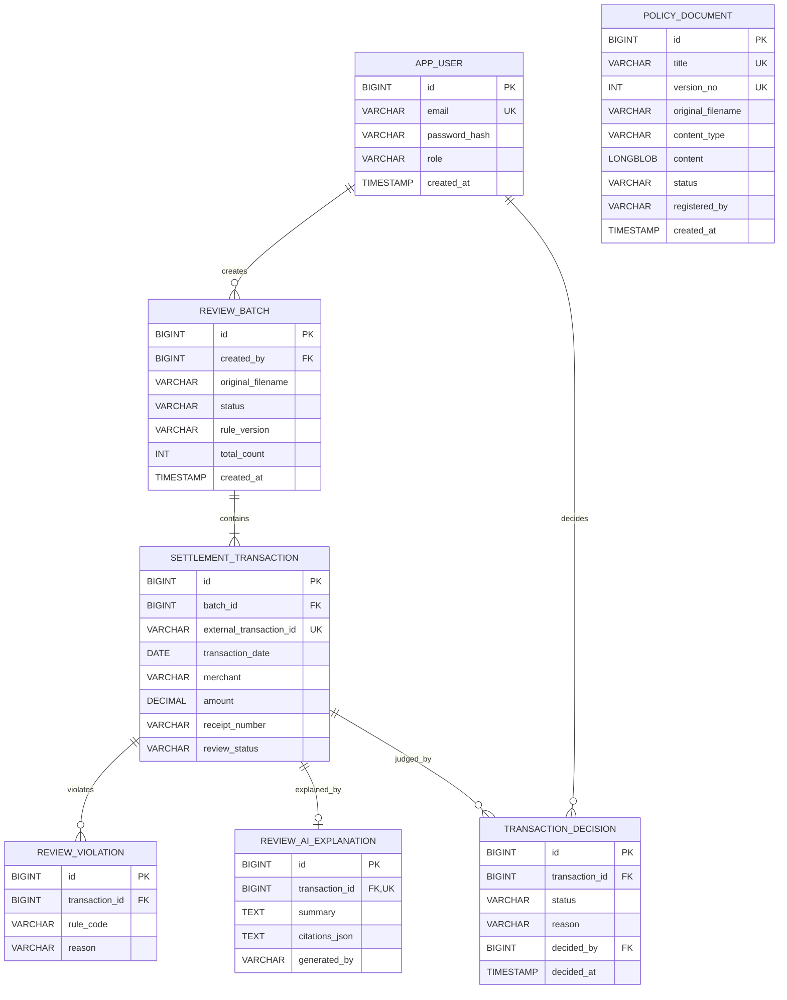

# ERD 및 데이터 정의

검수 파일 원본 대신 사용자, 정책, 검수 배치와 정규화된 결과를 관계형 데이터로 저장한다.

## 테이블별 역할

| 테이블 | 역할 | 주요 제약 |
|---|---|---|
| `app_user` | 로그인 사용자와 관리자 저장 | 이메일 유일성, BCrypt 비밀번호 해시 |
| `policy_document` | 등록한 정책 파일과 버전 저장 | 제목과 버전 조합 유일성 |
| `review_batch` | CSV 업로드 한 건의 처리 상태와 건수 저장 | 생성 사용자 외래 키 |
| `settlement_transaction` | 검수에 필요한 정규화 거래 필드 저장 | 배치 안에서 외부 거래 ID 유일성 |
| `review_violation` | 거래에 적용된 규칙 코드와 사유 저장 | 거래 외래 키, 거래당 여러 건 허용 |
| `review_ai_explanation` | RAG 또는 fallback 설명과 인용 저장 | 거래당 최대 한 건 |
| `transaction_decision` | 정상 처리·재확인·보류 판단 이력 저장 | 거래·판단 사용자 외래 키, 추가 전용 이력 |

## 데이터 정책

- `review_batch` 삭제 기능은 현재 제공하지 않아 감사 이력을 보존함
- 거래 원본 CSV 파일은 저장하지 않고 검수에 필요한 필드만 저장함
- `review_status`는 현재 상태를 빠르게 표시하고 `transaction_decision`은 변경 이력을 보존함
- 정책 원문은 관리자만 등록하며 동일 제목과 버전의 중복 등록을 막음
- `citations_json`은 RAG가 사용한 정책 근거 목록을 JSON 문자열로 보존함
- 모든 소유권 검사는 배치의 `created_by`를 기준으로 수행함
